# Phase 1: Lab Setup

Goal: build a domain controller (`DC01`) and a Windows 11 client (`PC-102`),
create the `yardstick.local` domain, and join the client to it.

[← Back to README](../README.md)

## Lab design

| Machine | Role                   | IP            | DNS           |
| ------- | ---------------------- | ------------- | ------------- |
| DC01    | Domain controller, DNS | 192.168.10.10 | 127.0.0.1     |
| PC-102  | Domain client          | 192.168.10.20 | 192.168.10.10 |

Both VMs use a VirtualBox **Internal Network** named `yardstick-lab`.
They can reach each other, but not my home network, like a small isolated office LAN.

## Progress

| Step | Task | Status |
| ---- | ---- | ------ |
| 1 | Create the DC01 VM | ✅ |
| 2 | Install Windows Server 2022 | ✅ (after Problems 1, 2, 3) |
| 3 | Rename to DC01 | ✅ |
| 4 | Set a static IP | ✅ (after Problem 5) |
| 5 | Install the AD DS role | ✅ (after Problem 4) |
| 6 | Promote to domain controller | ✅ |
| 7 | Verify the domain controller | ✅ |
| 8 | Create PC-102 and install Windows 11 | ✅ |
| 9 | Join PC-102 to the domain | ✅ (after Problem 6) |
| — | **Phase 1 complete** | ✅ |

---

## Step 1: Create the DC01 VM

Hardware virtualization was already enabled on the host:

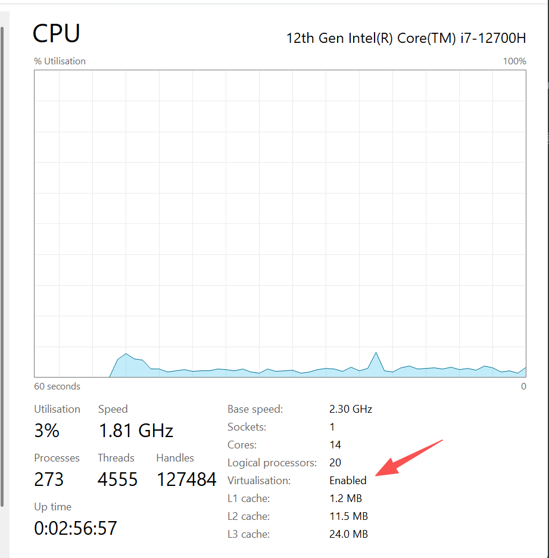

| Setting            | Value                            | Why                                                     |
| ------------------ | -------------------------------- | ------------------------------------------------------- |
| Name               | DC01                             | Name it before promotion. Renaming a DC later is risky. |
| ISO                | Windows Server 2022 Evaluation   | Free 180-day evaluation from Microsoft                  |
| Unattended install | Off                              | So I can choose the Desktop Experience edition myself   |
| Memory             | 4096 MB                          | Enough for a small lab DC                               |
| CPUs               | 2                                |                                                         |
| Disk               | 50 GB, dynamically allocated     | Uses real disk space only as data is written            |
| Boot order         | Optical before Hard Disk         | Boot from the ISO first                                 |
| Network            | Internal Network `yardstick-lab` | Isolated lab network                                    |

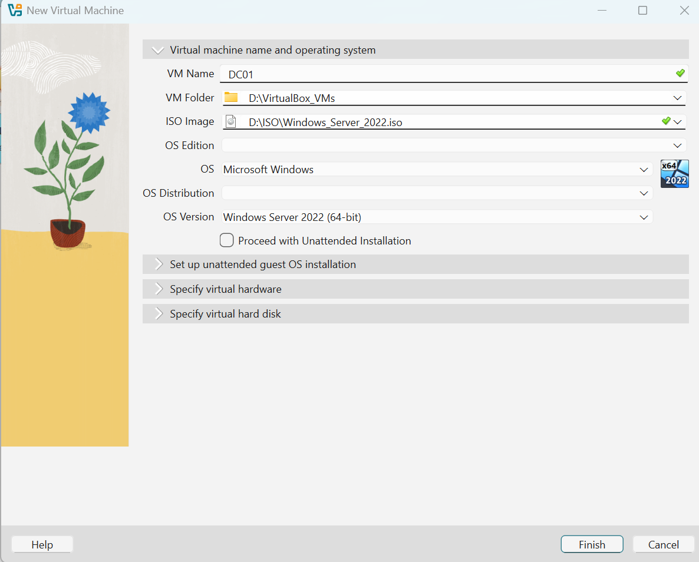
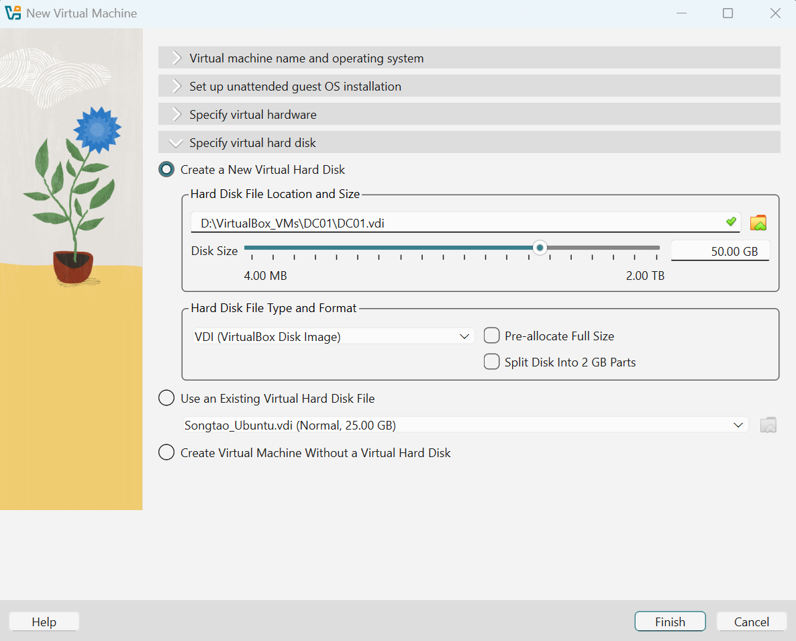
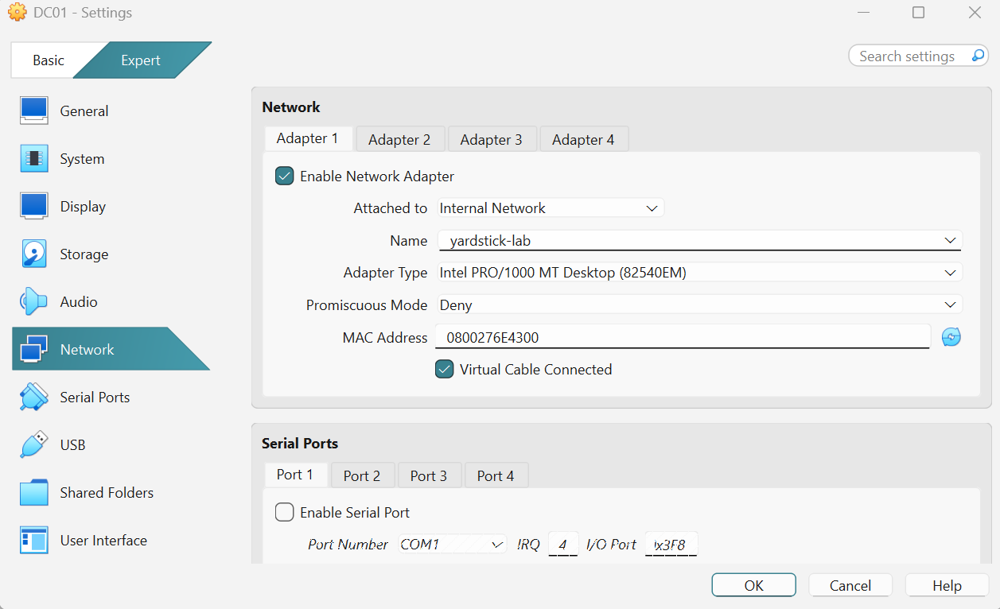

Status: ✅ Done

---

## Step 2: Install Windows Server 2022

Getting the installer to boot took three fixes (see Problems 1, 2 and 3).
I chose **Standard Evaluation (Desktop Experience)**, which includes the full GUI,
and a **Custom** install because the disk was empty.

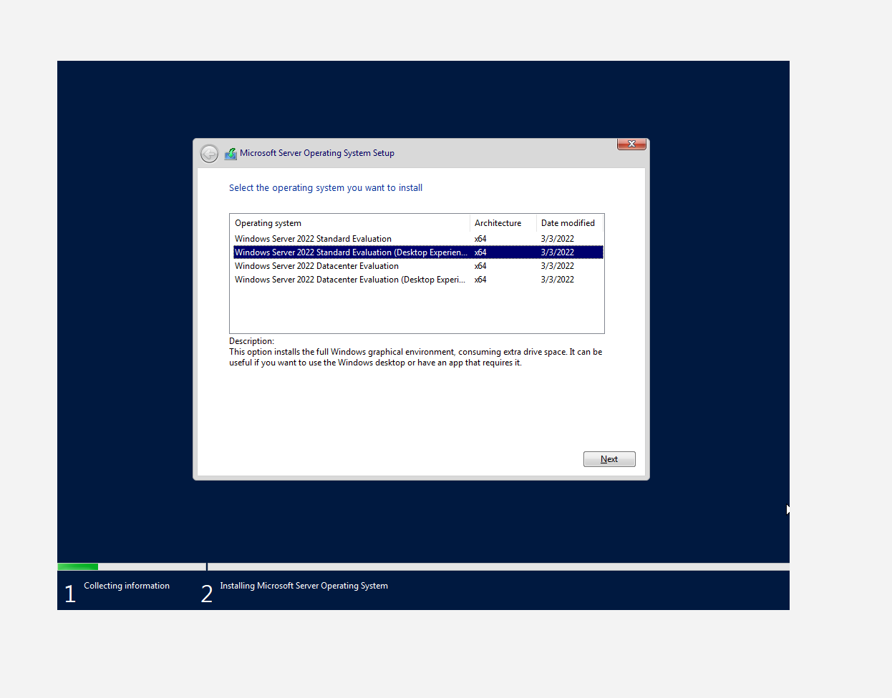
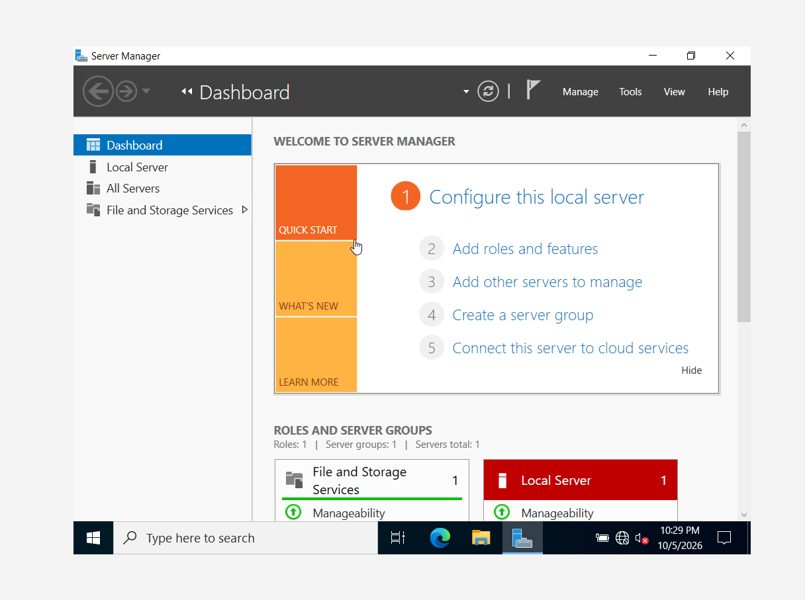

Status: ✅ Done

---

## Step 3: Rename the server to DC01

`Server Manager > Local Server > Computer name > Change...`

I renamed the server before promoting it, because renaming a domain controller later is risky.

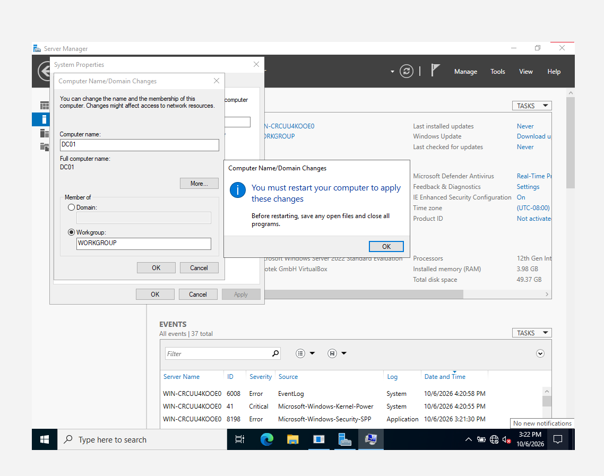

Verified after restart with `hostname`.

> Note: Server Manager showed Event ID 41 (Kernel-Power) and 6008 (unexpected shutdown).
> These came from powering off the VM during earlier troubleshooting, not from a real problem.

Status: ✅ Done

---

## Step 4: Set a static IP

`ncpa.cpl > Ethernet > Properties > Internet Protocol Version 4 (TCP/IPv4)`

| Setting         | Value         | Why                                                                  |
| --------------- | ------------- | -------------------------------------------------------------------- |
| IP address      | 192.168.10.10 | A DC needs a fixed IP so clients can always find it                  |
| Subnet mask     | 255.255.255.0 | Lab network is 192.168.10.0/24                                       |
| Default gateway | (blank)       | No router in the isolated lab network                                |
| Preferred DNS   | 127.0.0.1     | The DC will be the DNS server for the domain, so it points to itself |

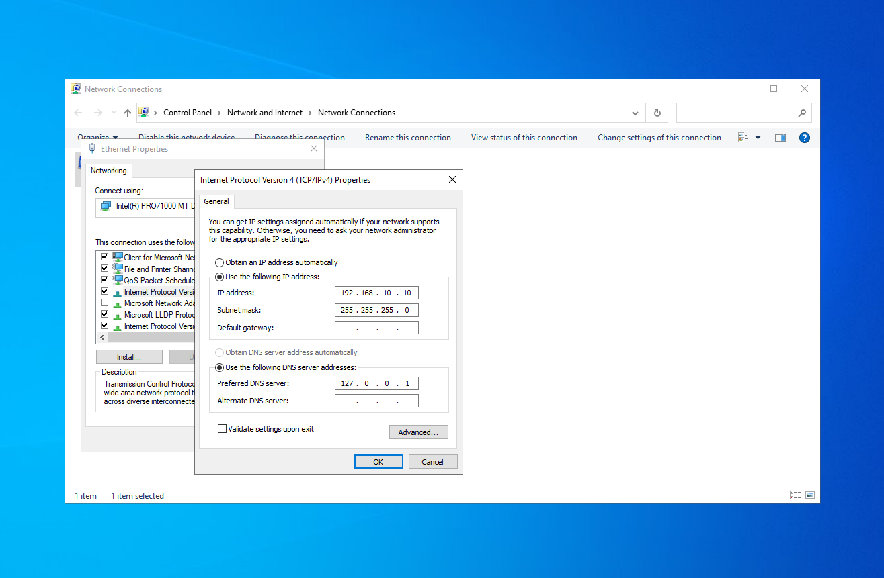

> **Update:** this setting was not actually saved the first time. I found out after
> promotion, when dcdiag failed. See [Problem 5](#problem-5-dcdiag-failed-the-connectivity-test).

Status: ✅ Done (after Problem 5)

---

## Step 5: Install the AD DS role

`Server Manager > Manage > Add Roles and Features > Active Directory Domain Services`

Installing the role only adds the software. The server is not a domain controller yet.
It still needs to be promoted.

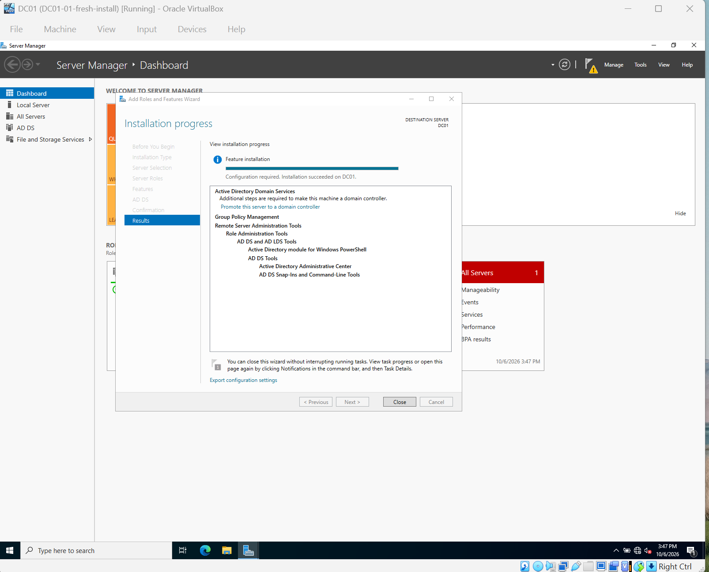

Status: ✅ Done (after Problem 4)

---

## Step 6: Promote DC01 to a domain controller

`Server Manager > Notifications flag > Promote this server to a domain controller`

| Wizard page | Choice | Why |
|---|---|---|
| Deployment Configuration | Add a new forest, `yardstick.local` | First DC, so it creates a new forest |
| Domain Controller Options | DNS server and Global Catalog checked, DSRM password set | DSRM is the recovery mode for AD |
| DNS Options | Ignored the delegation warning | Normal in a new forest with no parent zone |
| Additional Options | NetBIOS name `YARDSTICK` | Lets users sign in as `YARDSTICK\username` |
| Paths | Defaults (`C:\Windows\NTDS`, `C:\Windows\SYSVOL`) | NTDS.dit is the AD database, SYSVOL holds Group Policy files |

The server restarted, and I signed in as `YARDSTICK\Administrator`.

Status: ✅ Done

---

## Step 7: Verify the domain controller

| Check | Tool | Result |
|---|---|---|
| Domain exists | `Get-ADDomain` | DNSRoot `yardstick.local`, NetBIOS `YARDSTICK`, PDC `DC01.yardstick.local` |
| ADUC | `dsa.msc` | Domain Controllers OU contains DC01 |
| DNS zones | `dnsmgmt.msc` | `yardstick.local` and `_msdcs.yardstick.local` exist |
| SRV record | `nslookup -type=srv _ldap._tcp.dc._msdcs.yardstick.local` | Points to `dc01.yardstick.local`, port 389 |
| Health | `dcdiag /q` | No output, after fixing Problem 5 |

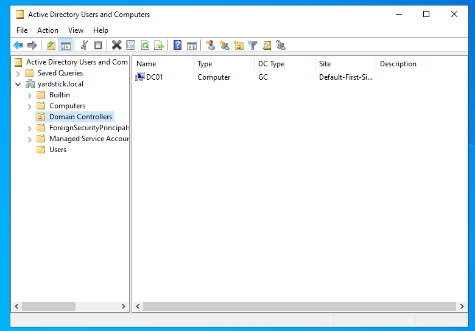
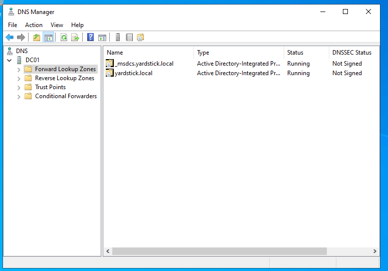

Snapshot taken: `DC01-03-dc-promoted-healthy`.

Status: ✅ Done

---

---

## Step 8: Create PC-102 and install Windows 11

VirtualBox detected **Windows 11 Enterprise Evaluation** in the OS Edition field.
That only works when the ISO contains an install image, so it confirmed the media was correct.
On the server, this field was empty, which was an early sign of Problem 3.

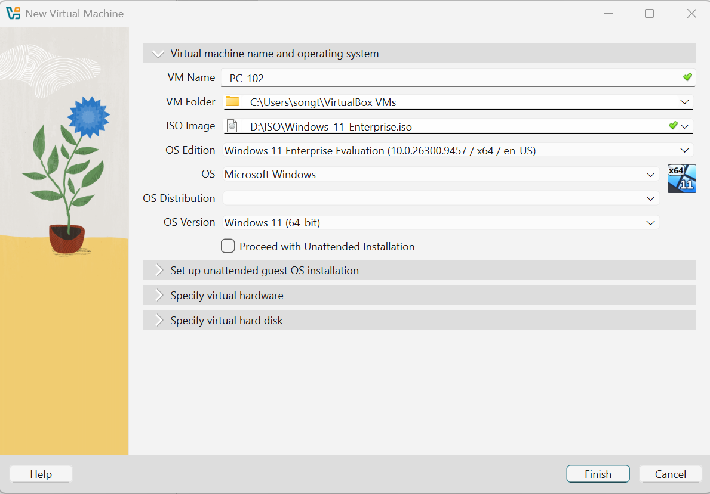

| Setting | Value | Why |
|---|---|---|
| Name | PC-102 | Matches the computer name it will have in AD |
| ISO | Windows 11 Enterprise Evaluation | Home edition can't join a domain |
| Memory / CPUs / Disk | 4096 MB / 2 / 64 GB | |
| UEFI, TPM 2.0, Secure Boot | On | Required by Windows 11 |
| Network | Internal Network `yardstick-lab` | Same network as DC01 |

There is no internet on the lab network, so during setup I created a **local admin account**.
If the PC ever loses contact with the domain, I can still sign in locally to fix it.

Status: ✅ Done

---

## Step 9: Join PC-102 to the domain

Before joining, I set the client's static IP (192.168.10.20) and pointed its DNS to DC01
(192.168.10.10). My first attempt had the DNS wrong, see Problem 6.

Then: `sysdm.cpl > Computer Name > Change > Domain: yardstick.local`,
using `YARDSTICK\Administrator`, and restarted.

**Verified on PC-102**

| Command | Result | Meaning |
|---|---|---|
| `whoami` | `yardstick\administrator` | Signed in with a domain account |
| `echo %logonserver%` | `\\DC01` | DC01 authenticated the logon |
| `systeminfo \| findstr /i "domain"` | `yardstick.local` | PC-102 is a domain member |

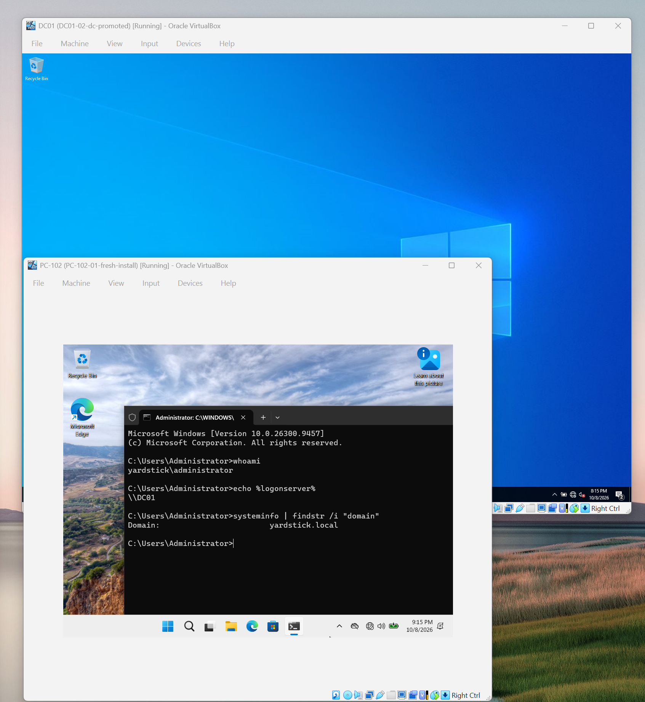

**Verified on DC01**

A computer object for PC-102 appeared in the default **Computers** container.
In a real company, I'd move it into the right OU so the correct Group Policies apply.

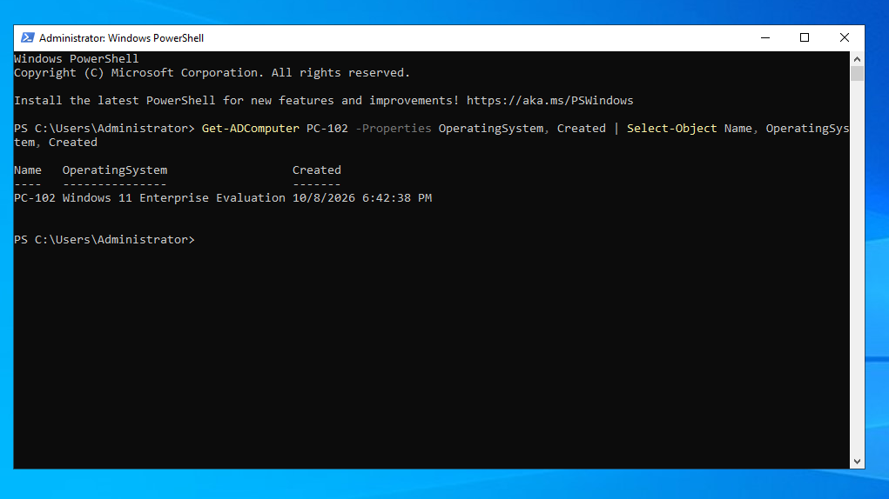

Snapshots: `DC01-04-client-joined`, `PC-102-02-domain-joined`.

Status: ✅ Done

## Troubleshooting

Each problem follows the same format I'd use in a real ticket:
**Symptom → Evidence → Cause → Fix → Result**.

| # | Problem | Root cause |
|---|---|---|
| 1 | VM failed to boot | ISO not attached |
| 2 | Black screen after boot | Hyper-V on the host |
| 3 | VM found the CD but would not boot | Downloaded the Language Packs ISO, not the install ISO |
| 4 | Installed the wrong role | Checked AD CS instead of AD DS |
| 5 | dcdiag failed the Connectivity test | Static IP not saved, adapter fell back to APIPA |

---

### Problem 1: VM failed to boot

**Symptom**

The VM stopped with _"No bootable medium found! Please insert a bootable medium and reboot."_

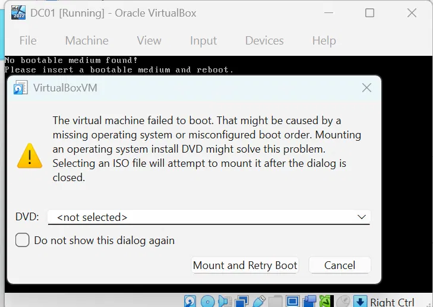

**Evidence**

The DVD field in the dialog showed `<not selected>`, so nothing was in the virtual optical drive.

**Cause**

The Windows Server ISO was not attached to the VM's optical drive.
With an empty hard disk and an empty DVD drive, there was nothing to boot from.

**Fix**

1. Powered off the VM.
2. `Settings > Storage`: attached the ISO to the optical drive.
3. `Settings > System`: confirmed **Optical** boots before **Hard Disk**.

**Note**

The same error also appears if you miss the _"Press any key to boot from CD or DVD"_ prompt.
Later I found the ISO itself was the wrong one, which was likely part of this problem too
(see Problem 3). **One error message can have more than one cause.**

---

### Problem 2: Black screen after boot

**Symptom**

After the ISO was attached, the VM showed only a black screen.
The VirtualBox status bar showed a green turtle icon with constant CPU activity.

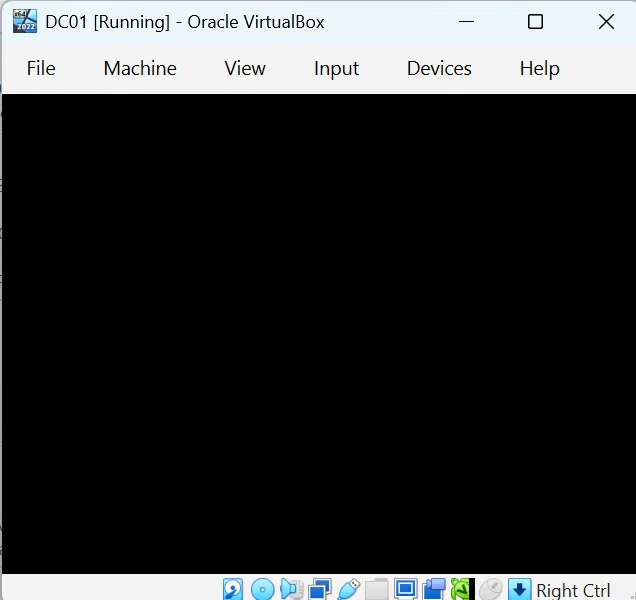

**Evidence**

`Machine > Session Information > Runtime Information`:

| Field               | Value        | Meaning                                                            |
| ------------------- | ------------ | ------------------------------------------------------------------ |
| VM Execution Engine | `native API` | VirtualBox is going through Hyper-V instead of using VT-x directly |
| Nested Paging       | Inactive     | Hardware acceleration is not in use                                |
| Screen Resolution   | `0x0`        | The virtual display never initialized                              |

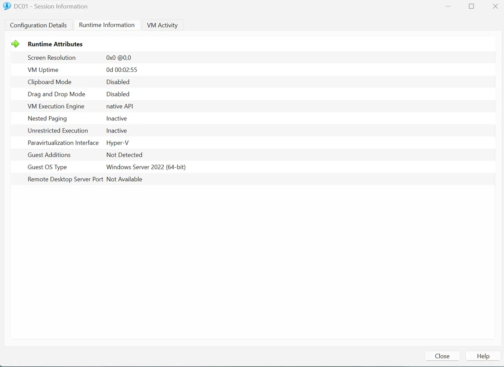

**Cause**

Hyper-V was running on the host. When Hyper-V is active, it owns the CPU's virtualization
features, so VirtualBox falls back to the much slower Native API mode.

**Fix**

All changes were made on the host, not inside the VM.

1. Turned off the Windows hypervisor at boot:

   ```powershell
   # Run as Administrator
   bcdedit /set hypervisorlaunchtype off
   ```

   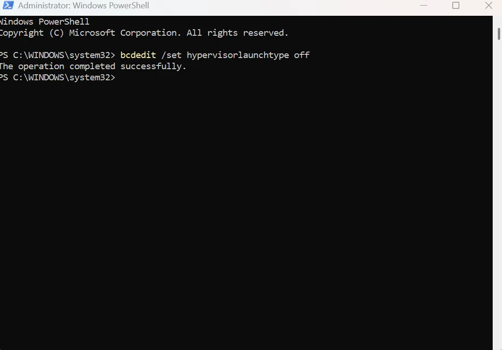

2. Turned off **Memory Integrity** in Windows Security > Device security > Core isolation.
   Memory Integrity uses virtualization-based security, which also keeps the hypervisor running.

   | Before | After |
   | --- | --- |
   | 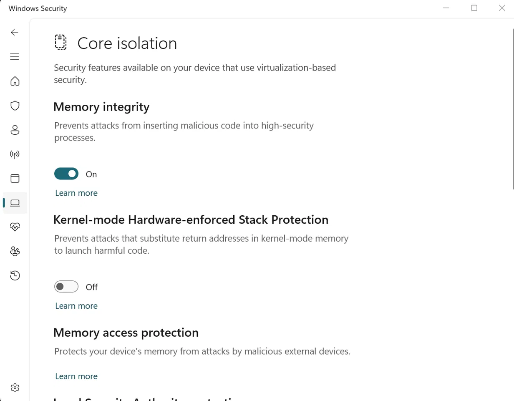 | 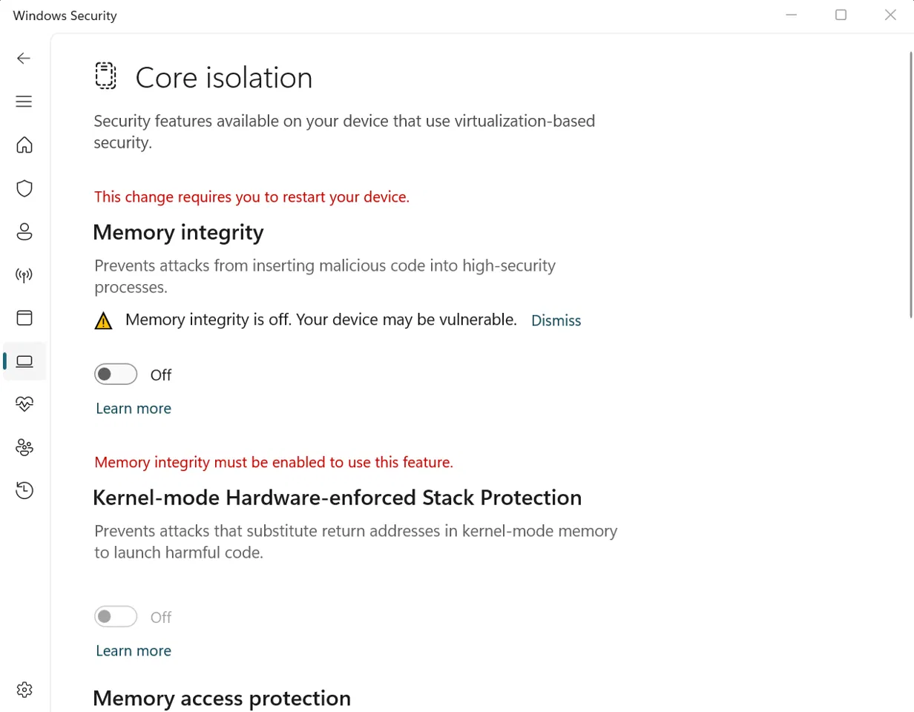 |

3. Disabled these Windows features: Hyper-V, Virtual Machine Platform, Windows Hypervisor Platform.
4. Rebooted the host.

**Security trade-off**

Turning off Memory Integrity lowers the host's protection against malicious kernel drivers.
It does not affect RAM. I accepted this for my personal lab machine, kept Defender and
Windows Update on, and documented how to undo it:

- `bcdedit /set hypervisorlaunchtype auto`
- Turn Memory Integrity back on
- Reboot

On a company laptop, I would not change a security setting like this without approval.

**Side note: landed in the UEFI setup menu**

After the reboot, I pressed keys repeatedly to catch the boot prompt, and one of them opened
the VM's UEFI firmware menu. I used **Boot Manager** to select the CD-ROM instead.

**Result**

| Field                  | Before     | After       |
| ---------------------- | ---------- | ----------- |
| VM Execution Engine    | native API | VT-x/AMD-V  |
| Nested Paging          | Inactive   | Active      |
| Unrestricted Execution | Inactive   | Active      |
| Screen Resolution      | 0x0        | 1280x800x32 |

"Paravirtualization Interface: Hyper-V" is still shown. That's expected: it's an interface
VirtualBox presents to Windows guests for better performance. It is not the host's Hyper-V.

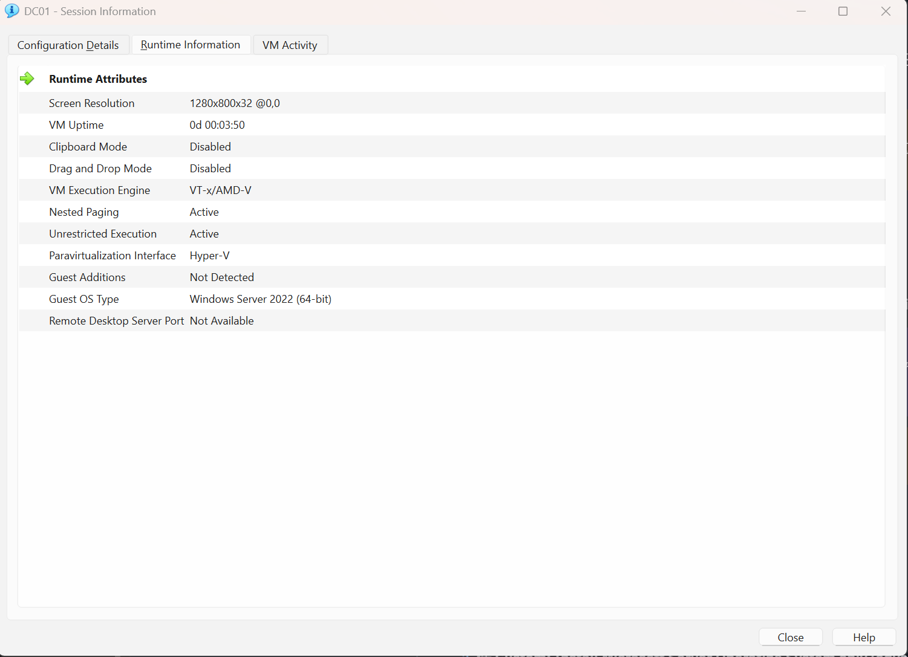

**Lesson**

The symptom was inside the VM, but the root cause was on the host.
I confirmed the cause with evidence before changing anything,
and I verified the fix with the same evidence afterward.

---

### Problem 3: VM found the CD but would not boot

**Symptom**

With VT-x working, selecting the CD-ROM in the VM's UEFI Boot Manager only flashed
the screen and returned to the menu.

**Evidence**

I mounted the ISO on my host. The volume label was `SERVER_FOD_LP_X64FRE_MULTI_DV9`,
and it only contained two folders. There was no `setup.exe`, no `sources\install.wim`,
and no boot files.

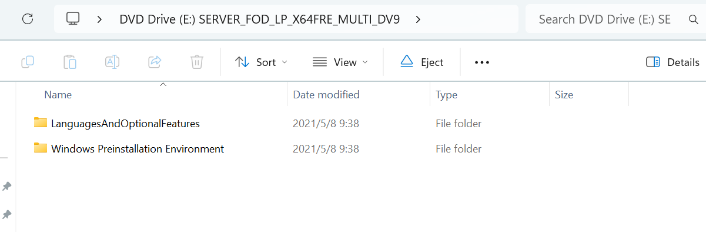

**Cause**

FOD_LP means *Features on Demand and Language Packs*. It's an add-on disc for a server
that's already installed, not installation media. On Microsoft's Evaluation Center page,
I clicked the "ISO" link in the overview text, which downloads this add-on ISO.
The installation ISO is under **Get started for free > Download the ISO**.

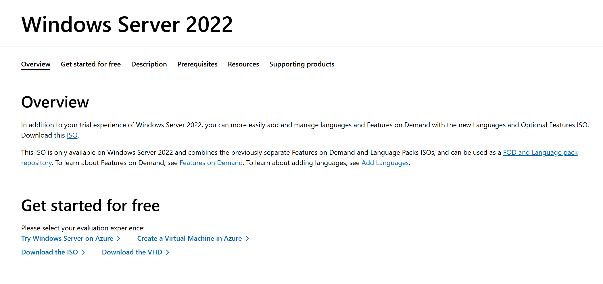

**Fix**

Downloaded the correct ISO, mounted it on the host to check for `setup.exe` and
`sources\install.wim`, then attached it to the VM.

**Result**

The installer booted and listed the Windows Server 2022 editions (see Step 2).

**Lesson / Prevention**

Verify install media before using it: file name, size, and contents.
When every setting looks right, check the input itself.

---

### Problem 4: Installed the wrong role (AD CS instead of AD DS)

**Symptom**

The results page said *Active Directory Certificate Services*, and a new **AD CS** item
appeared in Server Manager.

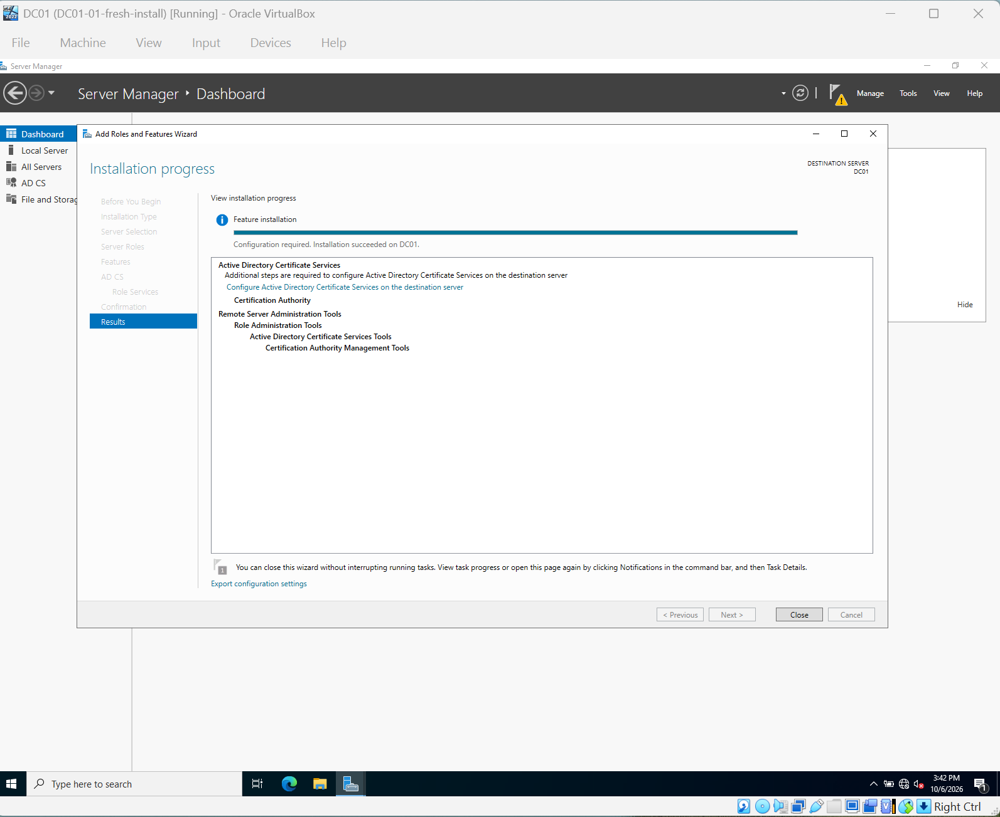

**Cause**

AD CS (Certificate Services) and AD DS (Domain Services) sit next to each other in the role list,
and I checked the wrong one.

| Role | Purpose |
|---|---|
| AD DS | Creates the domain, stores users and computers, handles logons |
| AD CS | Runs an internal certificate authority that issues certificates |

**Fix**

AD CS was installed but not configured yet, so removing it was clean:

```powershell
Uninstall-WindowsFeature ADCS-Cert-Authority -IncludeManagementTools -Restart
Install-WindowsFeature AD-Domain-Services -IncludeManagementTools
```

I did not revert to a snapshot, because the latest snapshot was taken before the rename and static IP.

**Result**

```powershell
Get-WindowsFeature AD-Certificate, AD-Domain-Services
```

AD-Certificate: Available. AD-Domain-Services: Installed.

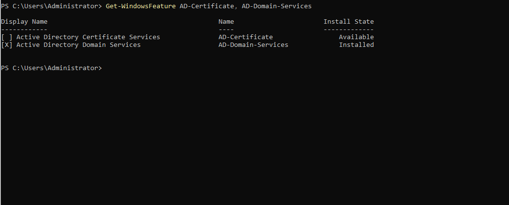

**Lesson / Prevention**

Read the confirmation page before clicking Install. If AD CS had been configured as a CA,
the server's name and domain membership would have been locked, and fixing it would be much harder.

---

### Problem 5: dcdiag failed the Connectivity test

**Symptom**

After promoting DC01, the domain and SRV record looked fine, but `dcdiag /q` reported:

```
The host <GUID>._msdcs.yardstick.local could not be resolved to an IP address.
Got error while checking LDAP and RPC connectivity.
DC01 failed test Connectivity
```

`nslookup yardstick.local` also returned a name but no address.

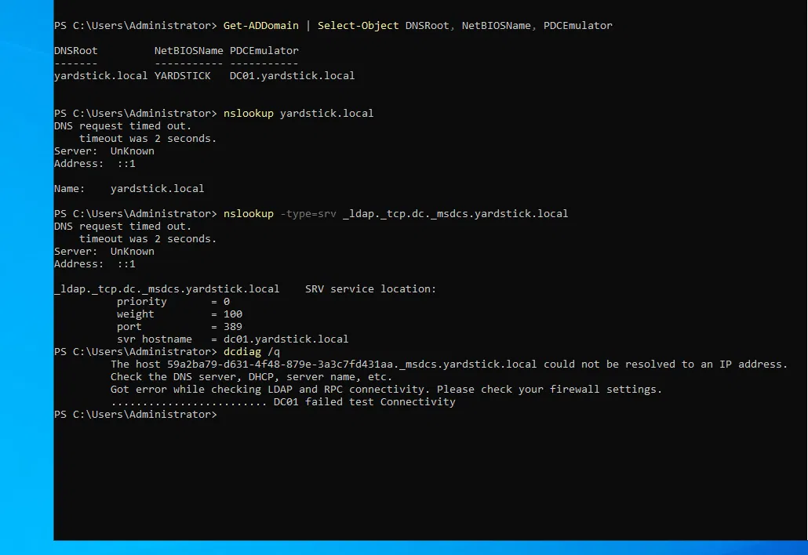

**Evidence**

1. `dc01.yardstick.local` resolved to **169.254.62.28**, not 192.168.10.10.
   169.254.x.x is an APIPA address, which Windows assigns itself when it has no valid IP.

   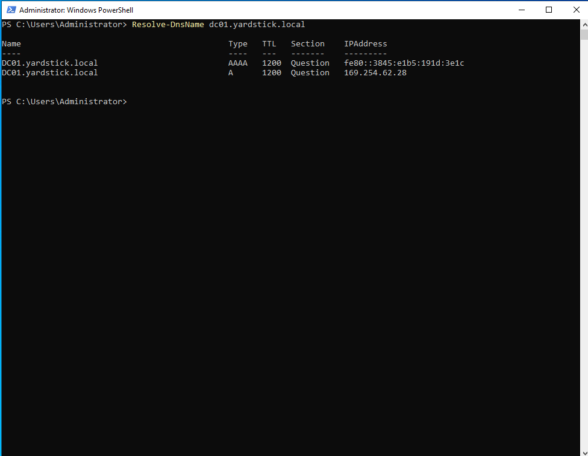

2. `ipconfig /all` showed **DHCP Enabled: Yes** and only an
   **Autoconfiguration IPv4 Address: 169.254.62.28**. There was no 192.168.10.10.
   DNS showed ::1 and 127.0.0.1 because the promotion wizard sets those automatically,
   which made the adapter look configured.

   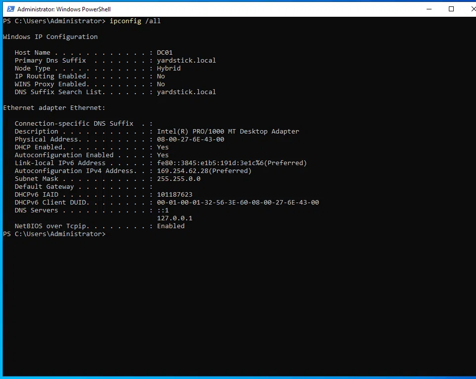

**Cause**

The static IP on DC01 was never saved (the dialog was not confirmed with OK).
The adapter stayed in DHCP mode, and with no DHCP server on the internal network,
Windows fell back to APIPA. The promotion wizard's prerequisite check had warned that an
adapter had no static IP, but I treated all yellow warnings as safe to ignore.

**Fix**

1. Set the static IP again in `ncpa.cpl` and clicked **OK** on both dialogs.

   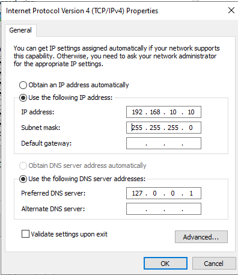

2. Confirmed with `ipconfig /all`: DHCP Enabled: No, IPv4 Address: 192.168.10.10.

   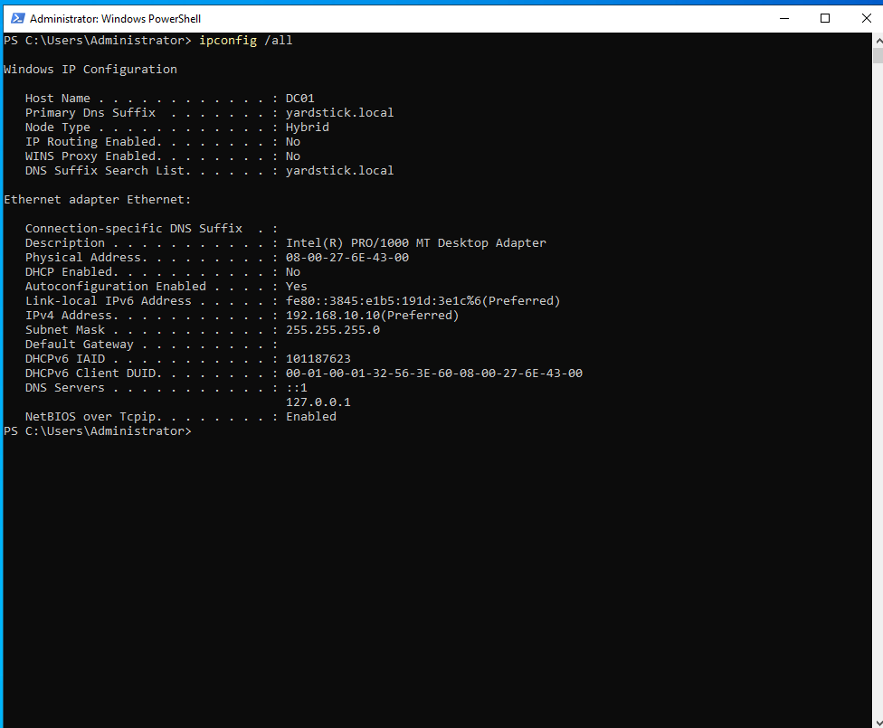

3. Re-registered DNS and restarted Netlogon:

   ```powershell
   ipconfig /registerdns
   Restart-Service Netlogon
   ```

   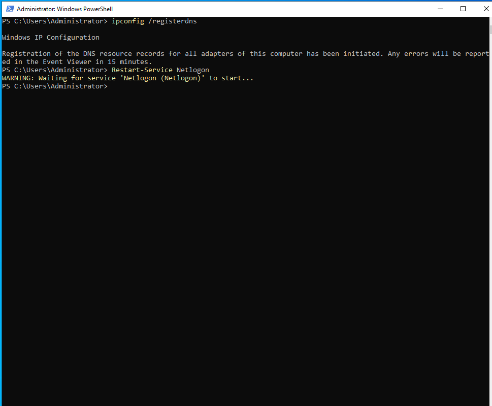

4. Checked DNS Manager: `dc01` and `(same as parent folder)` now point to 192.168.10.10.

   

**Result**

`dc01.yardstick.local` resolves to 192.168.10.10, and the Connectivity test passes.

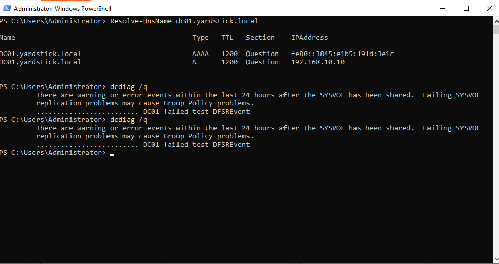

dcdiag still flagged **DFSREvent**. That test looks at Error and Warning events in the
DFS Replication log from the last 24 hours, so I checked whether SYSVOL was actually healthy:

- `net share` lists **SYSVOL** and **NETLOGON**, so SYSVOL is initialized and shared.

  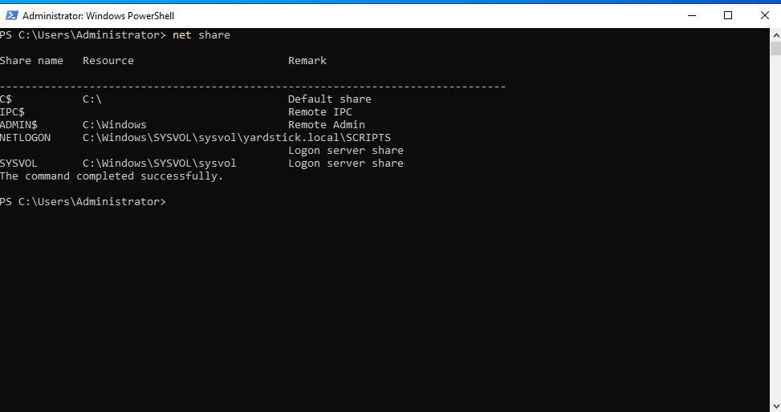

- The DFS Replication log shows Event **1202** (couldn't contact a DC) every hour while the
  adapter was on APIPA. After the fix: Event **4602** (SYSVOL initialized) and
  Event **6018** (configuration updated), with no new errors.

  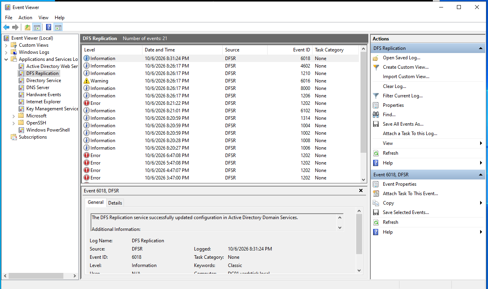

- The next day dcdiag still flagged DFSREvent. The DC was set to UTC-08:00, two hours behind
  my local time, so the last warning was only about 22 hours old. Listing the last 24 hours of
  errors and warnings showed only the two events from before the fix:

  ```powershell
  Get-WinEvent -FilterHashtable @{LogName='DFS Replication'; Level=2,3; StartTime=(Get-Date).AddHours(-24)} |
    Select-Object TimeCreated, Id, LevelDisplayName
  ```

  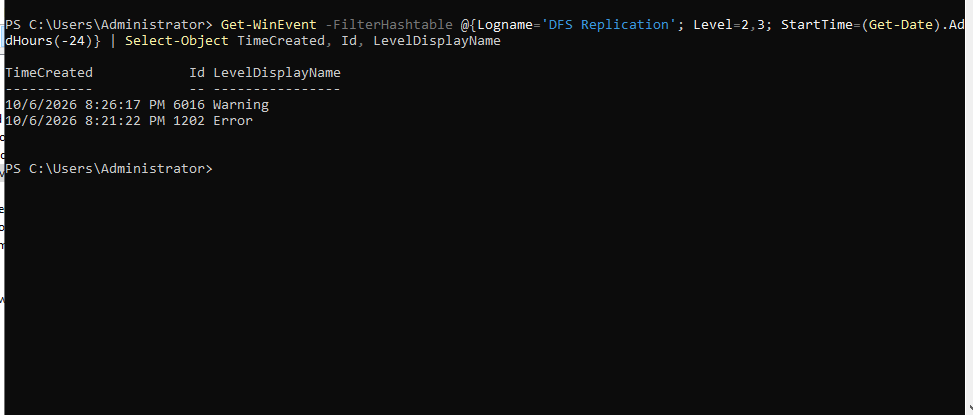

Once those events aged out, `dcdiag /q` returned no output:

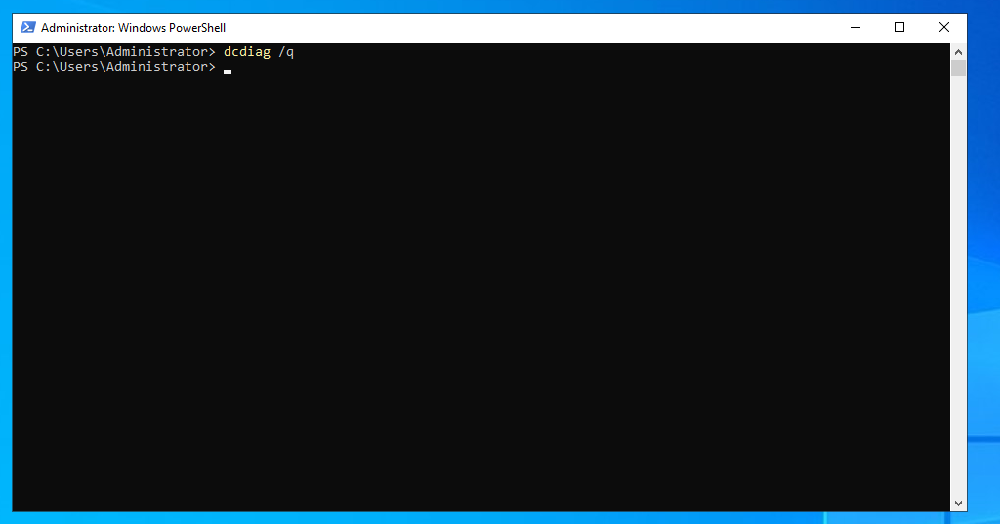

**Lesson**

- My first guess was a missing DNS record. The evidence (169.254 in `ipconfig /all`) pointed to
  the adapter. If I had run `ipconfig /registerdns` first, I would have registered the wrong address.
- When there are several errors, fix the first one. The firewall hint in dcdiag was a side effect.
- Some tools report history. DFSREvent was showing errors from before the fix.
- Check the time zone before reading log timestamps.
- Not every yellow warning is safe to ignore.

---

### Problem 6: PC-102 could not resolve yardstick.local

**Symptom**

Before joining the domain, `ping 192.168.10.10` worked, but `nslookup yardstick.local`
returned *No response from server*.

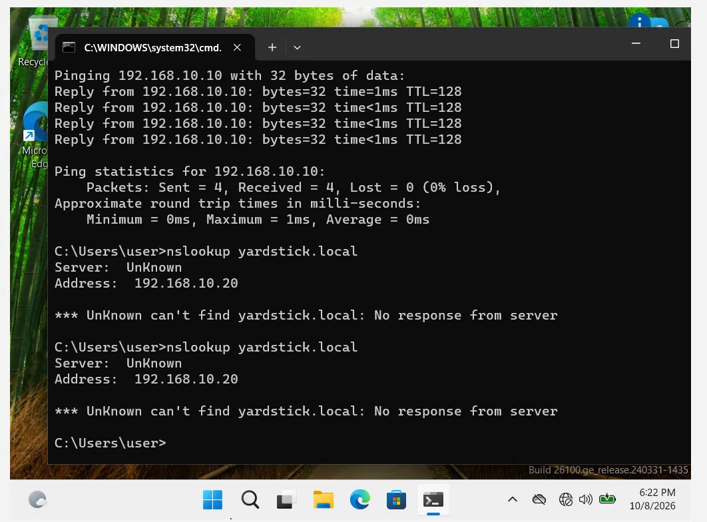

**Evidence**

- Ping succeeded, so the network path to DC01 was fine.
- nslookup showed the DNS server it was asking: **192.168.10.20**, which is PC-102 itself.
- `ipconfig /all` confirmed DNS Servers was set to 192.168.10.20.

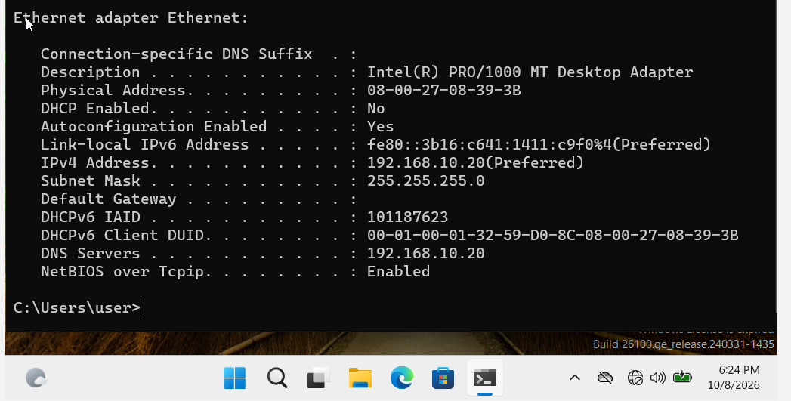

**Cause**

I typed the client's own IP into the Preferred DNS field instead of the DC's IP.
PC-102 doesn't run DNS, so nothing answered.

**Fix**

Set Preferred DNS to 192.168.10.10 and flushed the DNS cache.

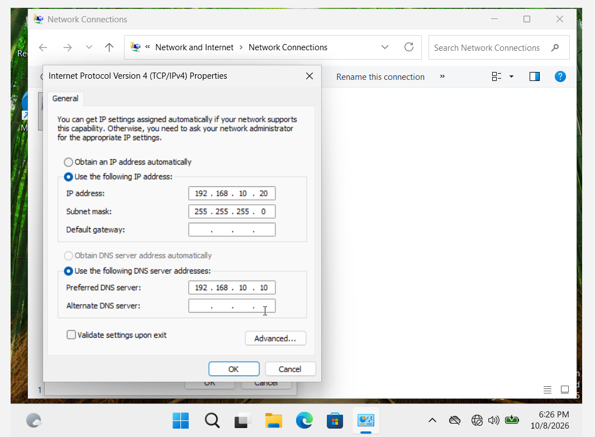

**Result**

`yardstick.local` resolves to 192.168.10.10, and the SRV record points to `dc01.yardstick.local`.

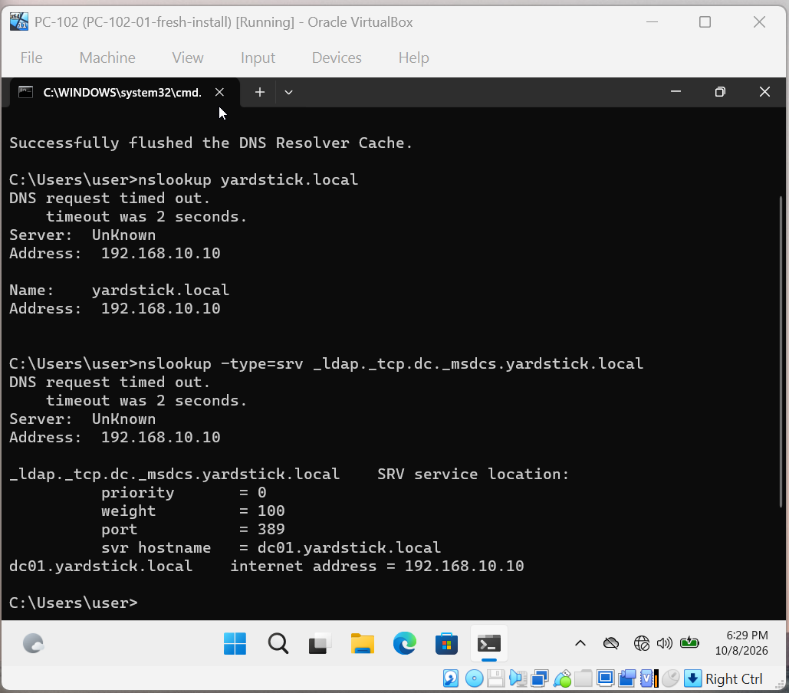

**Lesson**

Ping only proves the network works. nslookup's `Address:` line shows which DNS server
the client is actually asking. A client must use the DC for DNS, or it can't find the domain.