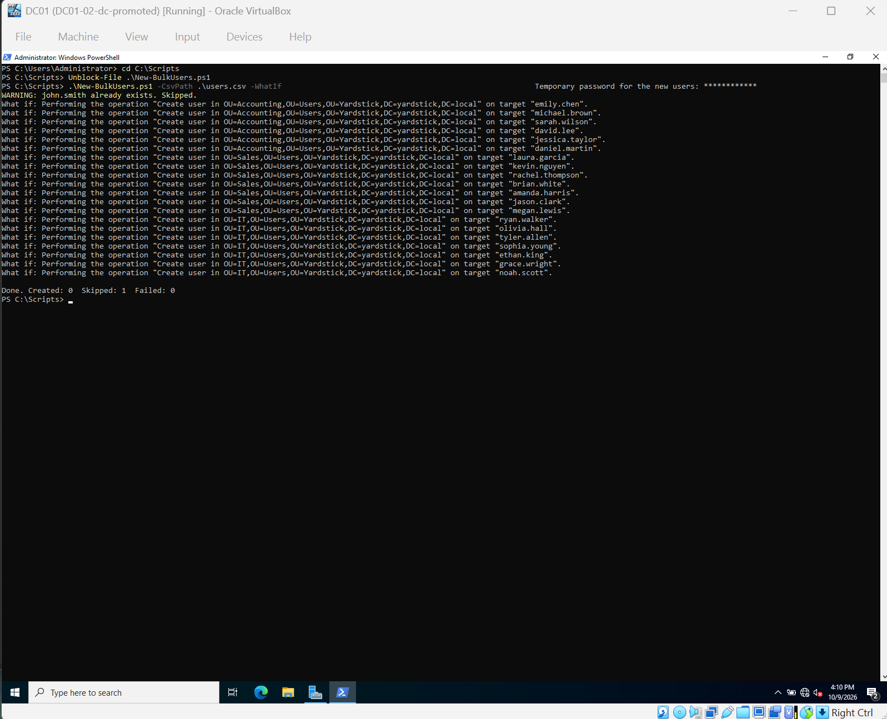
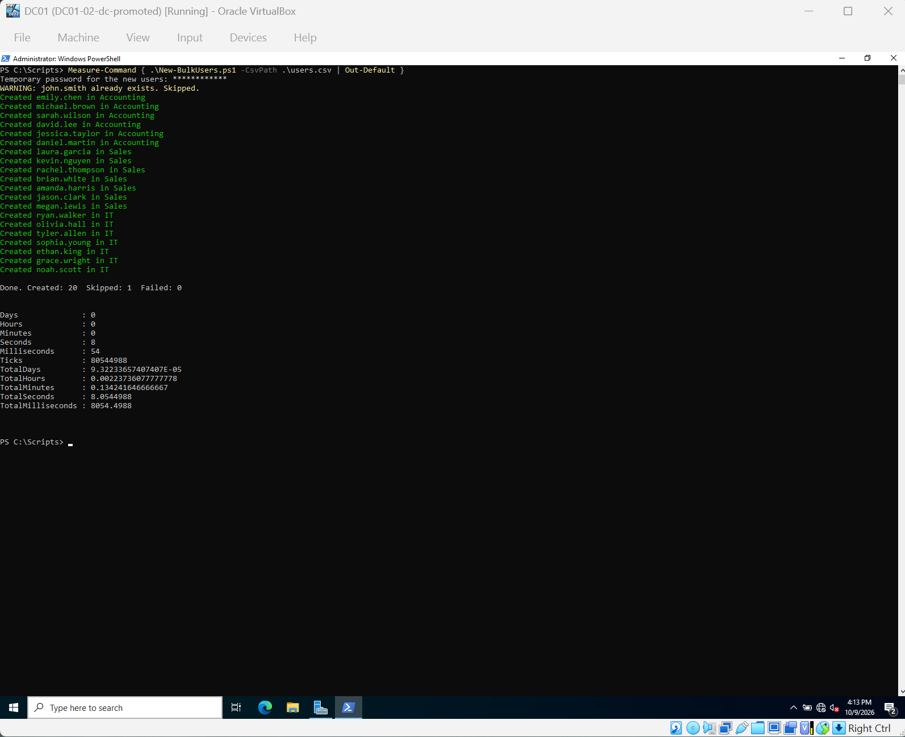
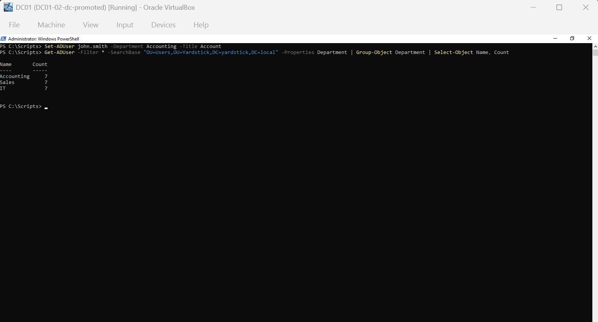
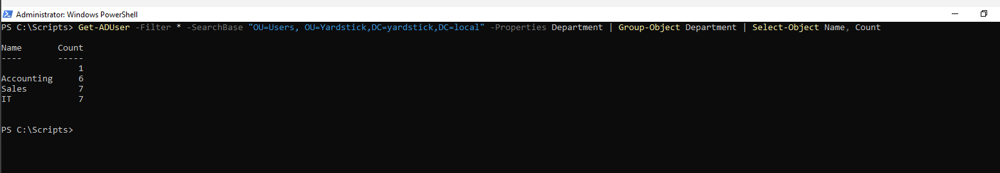
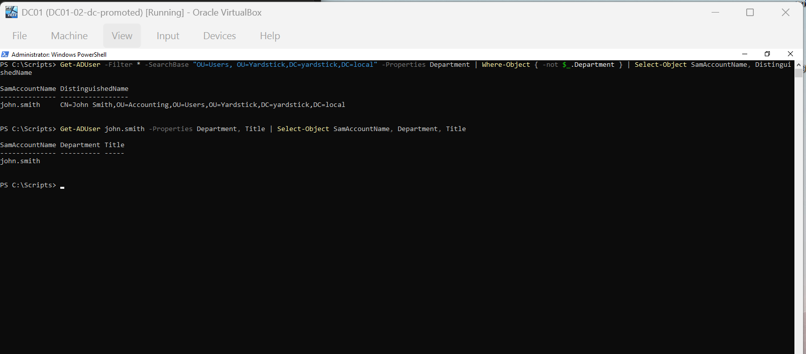

# Phase 2: User Management

Goal: organize the domain with OUs, create user accounts, and practice the most common
Tier 1 tickets: new users, password resets, unlocks, and disabling leavers.

[← Back to README](../README.md)

## Progress

| Step | Task | Status |
| ---- | ---- | ------ |
| 1 | Create the OU structure | ✅ |
| 2 | Create the first user and test sign-in | ✅ |
| 3 | Bulk-create users from CSV | ✅ (after Problem 7) |
| 4 | Tickets: reset, unlock, disable | ⬜ |

---

## Step 1: Create the OU structure

The default **Users** and **Computers** folders are containers, not OUs.
You can't link Group Policy to a container, so I built my own OU structure:

```
yardstick.local
└── Yardstick
    ├── Users
    │   ├── Accounting
    │   ├── Sales
    │   └── IT
    ├── Computers
    ├── Groups
    └── Disabled Users
```

Each OU has *Protect from accidental deletion* turned on.


---

Status: ✅ Done

## Step 2: Create the first user and test sign-in

New user in `Yardstick\Users\Accounting`:

| Field | Value |
|---|---|
| Name | John Smith |
| Logon name | `john.smith@yardstick.local` / `YARDSTICK\john.smith` |
| Password | Temporary, `<redacted>` |
| User must change password at next logon | ✅ |


The temporary password means only the user knows their real password, not IT.

**Checking the account**


```powershell
Get-ADUser john.smith -Properties Enabled, LockedOut, PasswordLastSet, PasswordExpired, DistinguishedName
```

`PasswordExpired: True` is expected, because the password must be changed at first logon.
This is the first command I'd run when a user says they can't sign in.


**Signing in on PC-102**

John was forced to change his password on first sign-in, then signed in successfully.
His account exists only in AD, and DC01 authenticated him.


Status: ✅ Done

---

---

## Step 3: Bulk-create users from CSV

Creating John Smith by hand took about 2 minutes. For a batch of new hires, I wrote
[`New-BulkUsers.ps1`](../scripts/New-BulkUsers.ps1), which reads
[`users.csv`](../scripts/users.csv) and creates each user in its department OU,
with Department and Title filled in.

| Design choice | Why |
|---|---|
| Password entered at run time (`Read-Host -AsSecureString`) | No password is stored in the script or the repo |
| Must change password at first sign-in | Only the user knows their real password |
| Skips users that already exist | Safe to run more than once |
| Supports `-WhatIf` | Preview before changing anything |
| try/catch with a summary | One failure doesn't stop the batch |

**Getting the files onto DC01.** I shared `scripts\` with the VM as a **read-only**
VirtualBox shared folder, then copied the files to `C:\Scripts` before running them,
so the execution policy doesn't block a script from a network path.

**Preview with -WhatIf.** The CSV included `john.smith` on purpose, to test the skip logic.

```powershell
.\New-BulkUsers.ps1 -CsvPath .\users.csv -WhatIf
```



**Run.** 20 users created, 1 skipped, 0 failed, in **X seconds**.

```powershell
Measure-Command { .\New-BulkUsers.ps1 -CsvPath .\users.csv | Out-Default }
```



**Verify.** The first count showed an empty group, see
[Problem 7](#problem-7-department-count-showed-an-empty-group).
After the fix, each department has 7 users:




Status: ✅ Done (after Problem 7)

## Troubleshooting

Same format as Phase 1: **Symptom → Evidence → Cause → Fix → Result**.

### Problem 7: Department count showed an empty group

**Symptom**

After the bulk run, grouping users by department showed Accounting 6, Sales 7, IT 7,
and an extra group with **no name and 1 user**.



**Evidence**

Filtering for users with no Department value returned only `john.smith`.
His DN showed he was in `OU=Accounting`, but his Department and Title attributes were empty.



**Cause**

I created John by hand in ADUC (Step 2) and only filled in his name and password.
The 20 scripted users got Department and Title from the CSV.
The OU is where an account lives. Department is a separate attribute, and placing a user
in an OU does not set it.

**Fix**

```powershell
Set-ADUser john.smith -Department Accounting -Title Accountant
```

**Result**

Each department now has 7 users, with no empty group.


**Lesson / Prevention**

- Check the data, not just the total. The total was right (21), but one record was incomplete.
- Address books, email signatures and dynamic groups often rely on attributes like Department.
  A missing attribute means that user silently drops out.
- Scripts fill in every attribute the same way, so bulk-created accounts are more consistent
  than hand-made ones. For one-off accounts, I'd fill in the Organization tab in ADUC too.