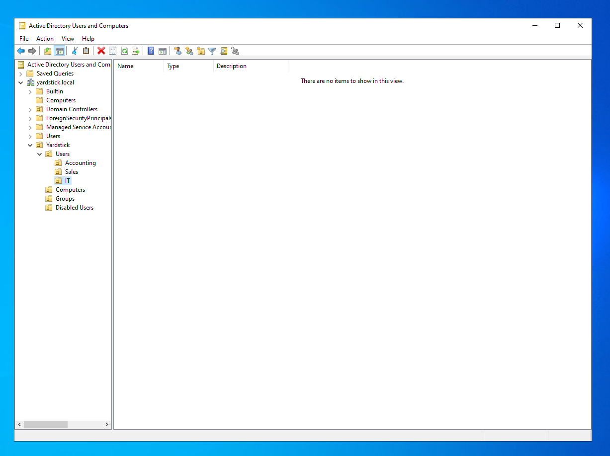
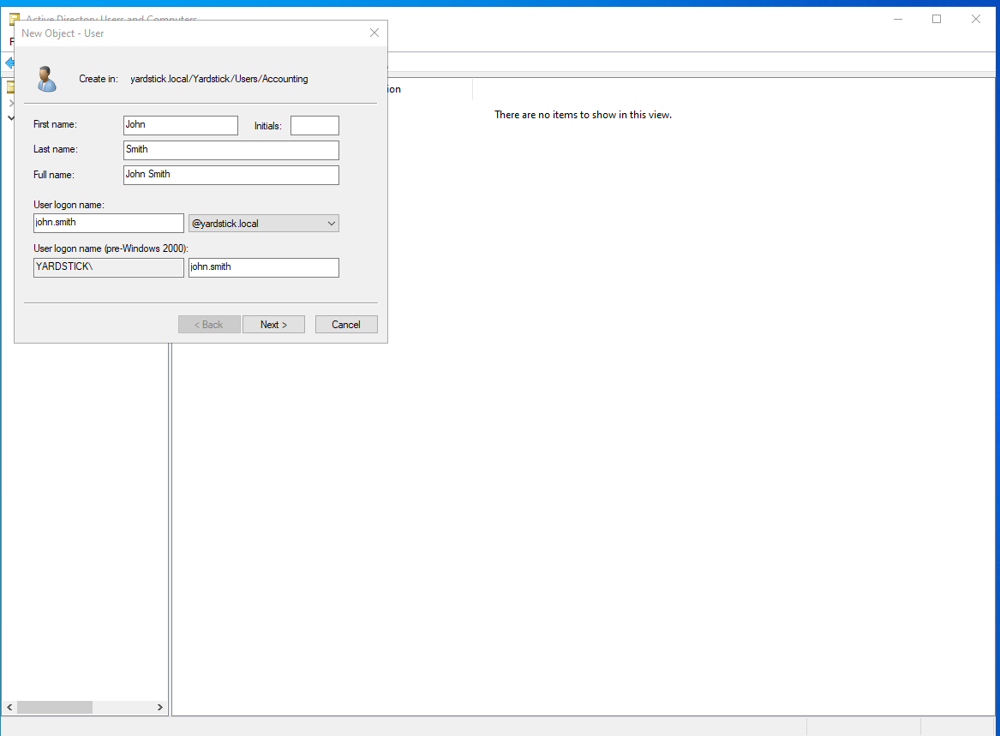
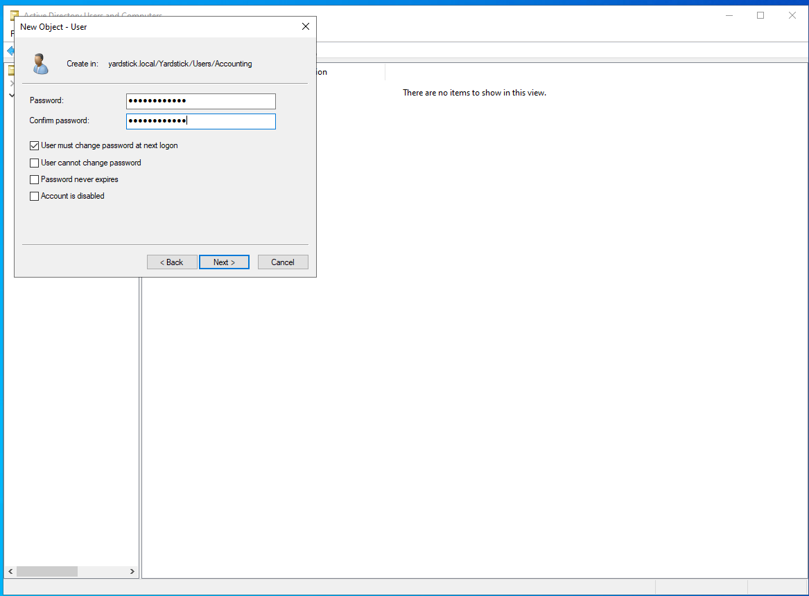
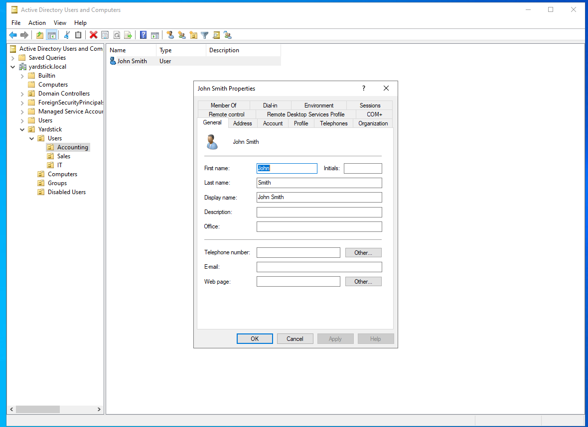
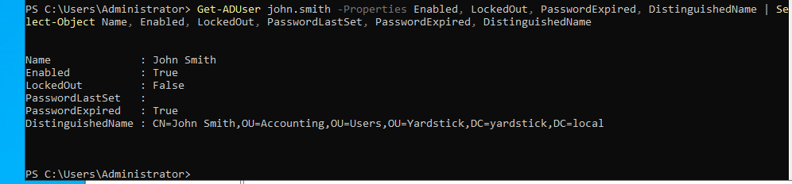
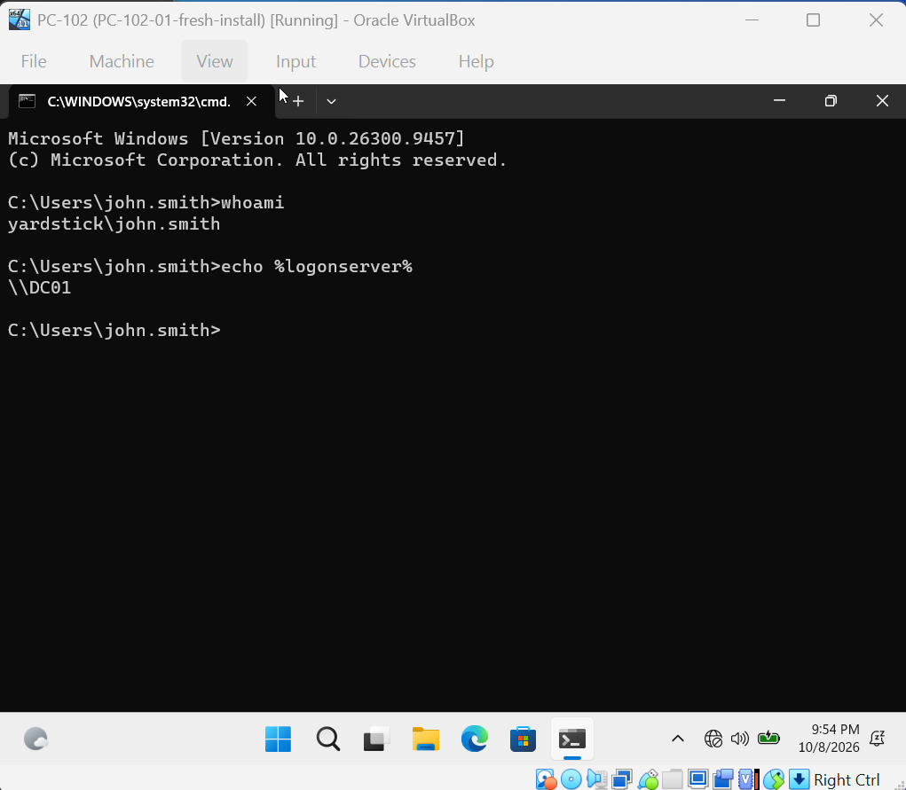

# Phase 2: User Management

Goal: organize the domain with OUs, create user accounts, and practice the most common
Tier 1 tickets: new users, password resets, unlocks, and disabling leavers.

[← Back to README](../README.md)

## Progress

| Step | Task | Status |
| ---- | ---- | ------ |
| 1 | Create the OU structure | ✅ |
| 2 | Create the first user and test sign-in | ✅ |
| 3 | Bulk-create users from CSV | ⬜ |
| 4 | Tickets: reset, unlock, disable | ⬜ |

---

## Step 1: Create the OU structure

The default **Users** and **Computers** folders are containers, not OUs.
You can't link Group Policy to a container, so I built my own OU structure:

```
yardstick.local
└── Yardstick
    ├── Users
    │   ├── Accounting
    │   ├── Sales
    │   └── IT
    ├── Computers
    ├── Groups
    └── Disabled Users
```

Each OU has *Protect from accidental deletion* turned on.



Status: ✅ Done

## Step 2: Create the first user and test sign-in

New user in `Yardstick\Users\Accounting`:

| Field | Value |
|---|---|
| Name | John Smith |
| Logon name | `john.smith@yardstick.local` / `YARDSTICK\john.smith` |
| Password | Temporary, `<redacted>` |
| User must change password at next logon | ✅ |




The temporary password means only the user knows their real password, not IT.

**Checking the account**



```powershell
Get-ADUser john.smith -Properties Enabled, LockedOut, PasswordLastSet, PasswordExpired, DistinguishedName
```

`PasswordExpired: True` is expected, because the password must be changed at first logon.
This is the first command I'd run when a user says they can't sign in.



**Signing in on PC-102**

John was forced to change his password on first sign-in, then signed in successfully.
His account exists only in AD, and DC01 authenticated him.




Status: ✅ Done